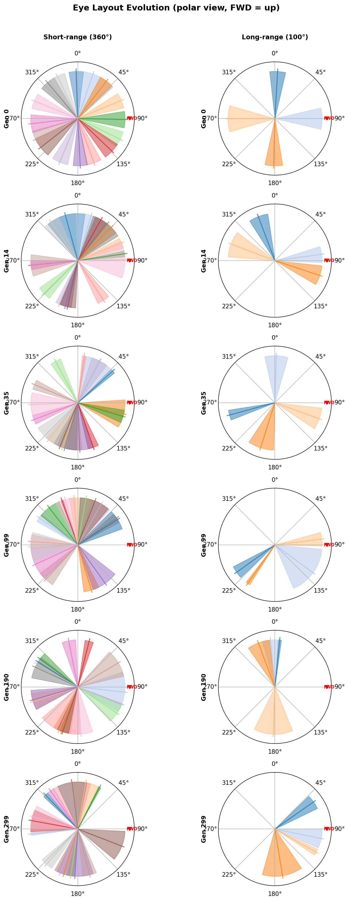

# Wildboids

[Dan / Claude Code writing smush].

**Evolved predator/prey boids.** Each boid is a thrust-driven body whose brain is a
[NEAT](https://en.wikipedia.org/wiki/Neuroevolution_of_augmenting_topologies)-evolved neural
network and whose sensory layout (its "eyes") evolves too. Feeding, evasion, hunting and flocking all *emerge* from selection pressure. A ground-up C++ rebuild of a 2007 Java simulation.


*Live simulation: predators (the bodies with radiating sensor lines) circling in the SDL3
renderer.*

## How it works

Each boid runs a three-stage pipeline, with the layers connected only by plain float arrays so
they can be developed, tested, and swapped independently. Then brain's inputs and outputs are as self-contained as possible, so it doesn't need to now about sense structure or physics.

```
Sensors  ──▶  Processing network (NEAT)  ──▶  Thrusters
 (vision +        (evolved topology +            (4 thrusters →
  speed)           weights)                       force + torque)
```

- **Two boid types.** Prey eat food and try to survive; predators hunt prey for energy.
  Run prey-only, or enable **co-evolution** where both populations evolve against each other
  in the same world.
- **Evolved brains.** NEAT grows both the weights *and* the topology of each network, with
  speciation protecting new structural innovations.
- **Evolved morphology.** Sensor counts, angles, and ranges are part of the genome (see the
  hero image above), so what a boid *can* perceive evolves alongside how it reacts.
- **Thrust-based physics.** Boids fire thrusters that produce force and
  torque on a rigid body with drag, so movement and turning have momentum and cost energy. (Forcing them into realistic physics avoids evolution 'hacking' their movement rules, as happened in the 2007 version.)



*Evolved sensor ("eye") layouts across generations: short-range 360° vision on the left,
long-range 100° vision on the right.*

The simulation core is a pure library with no graphics dependencies so it can run headless and at speed; the SDL3 renderer is only
ever a consumer of state. See the [documentation](#documentation) below for the full design
rationale.

## Build

C++20 · CMake ≥ 3.20 · Ninja · Apple Clang. `Catch2` and `nlohmann/json` are fetched
automatically by CMake; the only external dependency you install yourself is **SDL3** (needed
for the GUI target):

```bash
brew install sdl3 ninja cmake          # macOS

# Debug build (ASan + UBSan on)
cmake -B build -G Ninja -DCMAKE_BUILD_TYPE=Debug
cmake --build build
ctest --test-dir build --output-on-failure

# Release build — no sanitizers, ~30× faster; use this for evolution runs
cmake -B build-release -G Ninja -DCMAKE_BUILD_TYPE=Release
cmake --build build-release
```

## Quick start

```bash
# Watch random-weight boids move — sanity-check the physics with no evolution
./build-release/wildboids --boids 30

# Evolve prey from scratch (headless), saving champions as fitness improves
./build-release/wildboids_headless --generations 100 --save-best > log.csv

# Watch an evolved champion swim
./build/wildboids --champion data/champions/prey_best.json --boids 50
```

The full flag reference for both executables, the champion-packaging helper, and every tunable
NEAT parameter is in the [Usage reference](#usage-reference) below.

## Project status

Active rebuild, currently **Phase 5b — predator co-evolution** (~200 Catch2 tests passing).
The C++ simulation, NEAT evolution, headless runner, and SDL3 GUI are all working; current work
is tuning the predator/prey balance.

## Documentation

Design notes, theory, and build history live in [`planningdocs/`](planningdocs/). The
[`planning_archive/`](planningdocs/planning_archive/) subfolder is historical and safe to skip.

**Research & theory**

- [evolution_neuralnet_thrusters.md](planningdocs/evolution_neuralnet_thrusters.md) — NEAT design rationale and the sensors → network → thrusters architecture
- [evolution_theory.md](planningdocs/evolution_theory.md) — evolutionary-algorithm theory behind the run
- [boid_theory.md](planningdocs/boid_theory.md) · [boid_theory2.md](planningdocs/boid_theory2.md) — boid behaviour and flocking theory
- [sense_system_planning.md](planningdocs/sense_system_planning.md) — sensory ("eye") system design
- [spec_chat.md](planningdocs/spec_chat.md) — spec design discussion

**Build & planning logs**

- [build_log.md](planningdocs/build_log.md) — chronological build history
- [forward_plan.md](planningdocs/forward_plan.md) — roadmap and future directions
- [feature_history.md](planningdocs/feature_history.md) — feature-by-feature changelog
- [dan_log.md](planningdocs/dan_log.md) — developer notes
- [portability_planner.md](planningdocs/portability_planner.md) — cross-platform planning
- [spec.md](planningdocs/spec.md) — the usage reference reproduced below

**Archive (historical)**

- [toplevel_planner.md](planningdocs/planning_archive/toplevel_planner.md) · [plan_newplatform.md](planningdocs/planning_archive/plan_newplatform.md) · [fromjava_gotchas.md](planningdocs/planning_archive/fromjava_gotchas.md) · [oldjavacode_summary.md](planningdocs/planning_archive/oldjavacode_summary.md) · [oldspec.md](planningdocs/planning_archive/oldspec.md)

## License

[MIT](LICENSE) © 2026 Dan Olner.

---

# Usage reference

The rest of this page is the working reference for the two executables, the champion-packaging
helper, and the NEAT tuning parameters.

## Headless Runner CLI (`wildboids_headless`)

Runs evolution without graphics. Outputs CSV to stdout, status/diagnostics to stderr.

### Config

| Flag | Default | Description |
|------|---------|-------------|
| `--config PATH` | `data/sim_config.json` | Sim config JSON (world, food, energy, NEAT params). CLI flags below override values from this file. |
| `--spec PATH` | `data/simple_boid.json` | Prey boid spec JSON (sensors, thrusters, physics). |
| `--predator-spec PATH` | *(none)* | Predator boid spec. **Providing this enables co-evolution mode.** Without it, runs prey-only. |

### Evolution (override config)

| Flag | Default | Description |
|------|---------|-------------|
| `--generations N` | from config | Number of generations to run. |
| `--seed N` | 42 | RNG seed for reproducibility. |
| `--population N` | from config | Prey population size. |
| `--predator-population N` | same as prey | Predator population size (co-evolution only). |
| `--ticks N` | from config | Simulation ticks per generation. |

### World (override config)

| Flag | Default | Description |
|------|---------|-------------|
| `--world-size N` | from config | World width and height (square). |
| `--food-max N` | from config | Max food items in the world. |
| `--food-rate F` | from config | Food spawns per second. |
| `--food-energy F` | from config | Energy per food item. |
| `--metabolism F` | from config | Energy lost per second (base metabolic cost). |
| `--thrust-cost F` | from config | Energy cost per unit thrust per second. |
| `--angular-drag F` | from config | Angular drag coefficient. |
| `--linear-drag F` | from config | Linear drag coefficient. |

### Output

| Flag | Default | Description |
|------|---------|-------------|
| `--save-best` | off | Save champion JSON whenever a new all-time best fitness is found. |
| `--save-interval N` | from config | Save champion every N generations. |
| `--output-dir PATH` | `data/champions` | Directory for saved prey genomes. Predator champions go to `{output-dir}/predators/`. |

### CSV Output

**Prey-only mode:** `gen,best_fitness,mean_fitness,species_count,pop_size,survivors`

**Co-evolution mode:** `gen,prey_best,prey_mean,pred_best,pred_mean,prey_species,pred_species,prey_survivors,pred_survivors`

### Examples

```bash
# Prey-only evolution
./build-release/wildboids_headless --generations 100 --save-best > log.csv

# Co-evolution with custom populations and world size
./build-release/wildboids_headless \
  --predator-spec data/simple_predator.json \
  --population 150 --predator-population 50 \
  --world-size 3000 --generations 50 --save-best > coevo.csv
```

---

## GUI (`wildboids`)

Loads evolved champions (or random-weight boids) and renders the live simulation with SDL3. Status/diagnostics go to stderr. Run from the project root so default data paths resolve.

### CLI Flags

| Flag | Default | Description |
|------|---------|-------------|
| `--champion PATH` | *(none)* | Load evolved prey champion JSON. Without it, prey spawn with random NEAT weights from `data/simple_boid.json`. |
| `--prey-champion PATH` | *(none)* | Alias for `--champion`. |
| `--predator-champion PATH` | *(none)* | Load evolved predator champion JSON. Implies predators are present (count defaults to 10 if `--predators` not given). |
| `--boids N` | 30 | Number of prey boids. |
| `--predators N` | 0 | Number of predator boids. Falls back to `data/simple_predator.json` if no `--predator-champion` given. |
| `--config PATH` | `data/sim_config.json` | Sim config JSON. Use the **same** config the champion evolved under so physics replay identically. |
| `--package NAME` | *(none)* | Load prey champion, predator champion, and config together from `data/champion_packages/NAME/` (see [Packaging Champions](#packaging-champions-admin_codepackage_championspy)). Explicit `--prey-champion` / `--predator-champion` / `--config` flags override the package's files. A package with a predator champion auto-spawns predators (count via `--predators`, default 10). |
| `--world-size N` | from config | World width and height in world units (square). Overrides `world` size in the config (and any `--package` config). Applied before spawning, so wrapping and the default window size pick it up. |
| `--window-size N` | world size | Window size in pixels. Independent of `--world-size`: a smaller window just scales (zooms) the same world. |
| `--help` | — | Show usage and exit. |

### Examples

```bash
# Watch a single evolved prey champion (50 boids of it)
./build/wildboids --champion data/champions/prey_best.json --boids 50

# Random-weight prey (no champion) — useful for sanity-checking physics
./build/wildboids --boids 30

# Evolved predator vs evolved prey, 10 predators
./build/wildboids \
  --prey-champion data/champions/prey_best.json \
  --predator-champion data/champions/predators/pred_best.json \
  --predators 10

# Replay a champion under the exact config it evolved with, in a smaller window
./build/wildboids --champion data/champions/prey_best.json \
  --config data/sim_config.json --window-size 900

# Replay a packaged matchup (prey + predator + config) by folder name
./build/wildboids --package 2026-03-02

# Same package, but override the predator count
./build/wildboids --package 2026-03-02 --predators 30

# Override the world size (square), independent of window size
./build/wildboids --champion data/champions/prey_best.json \
  --world-size 2000 --window-size 900
```

### Keyboard & Mouse Controls

Source of truth: `src/display/app.cpp` (`App::handle_events`).

| Input | Action |
|-------|--------|
| **Space** | Pause / resume |
| **Escape** | Quit |
| **T** | Toggle thruster display |
| **D** | Toggle neighbour lines |
| **S** | Toggle sensor arcs |
| **F** | Cycle sim speed (1 → 2 → 4 → 8 → 16 → 1×) |
| **P** | Dump first predator's sensor diagnostic CSV to `sensor_debug.csv` |
| **K / L** | Select previous / next boid |
| **Mouse click** | Select boid under cursor |

When **paused** with a boid selected:

| Input | Action |
|-------|--------|
| **Arrow keys** | Nudge selected boid's position |
| **, / .** | Rotate selected boid ±1° |

---

## Packaging Champions (`admin_code/package_champions.py`)

Standalone Python helper (not part of the C++ build) that bundles a matched prey + predator champion together with the `sim_config.json` they evolved under, into a dated folder. This keeps a self-contained "matchup" that the GUI can replay with identical physics, even as later runs overwrite the loose champion files in `data/champions/`.

### What it produces

A folder `data/champion_packages/YYYY-MM-DD/` (auto-suffixed `_2`, `_3`, … if the date already exists) containing:

| File | Source | Notes |
|------|--------|-------|
| `champion_prey_genN.json` | `data/champions/` | Falls back to `champion_genN.json` for prey-only runs. |
| `champion_predator_genM.json` | `data/champions/predators/` | Omitted if no predator champion is found. |
| `sim_config.json` | `data/sim_config.json` | Snapshot of the world/physics config. |

### Modes

| Invocation | Behaviour |
|------------|-----------|
| *(no args)* | **Auto:** reads `coevolution_log.csv` and picks the prey/predator generations with the highest `prey_best` / `pred_best` fitness. Falls back to highest generation if the log is absent. |
| `--prey N --pred M` | **Explicit:** package the named generation numbers. |
| `--latest` | **Highest generation:** pick the largest `genN`, regardless of fitness. |

### Examples

```bash
# Auto-pick the fittest prey + predator from coevolution_log.csv
python3 admin_code/package_champions.py

# Package specific generations
python3 admin_code/package_champions.py --prey 137 --pred 109

# Package the highest-numbered generation
python3 admin_code/package_champions.py --latest
```

The script prints the folder name on completion (e.g. `2026-03-02`), suitable for a commit message. Replay a package in the GUI with `wildboids --package NAME` (see the [GUI](#gui-wildboids) section), which loads all three files by folder name.

---

## NEAT Parameters (`sim_config.json` → `"neat"` block)

Maps to `PopulationParams` in `src/brain/population.h`.

### Structural Mutation

| Parameter | Default | Description |
|-----------|---------|-------------|
| `addNodeProb` | 0.1 | Chance per genome of splitting a connection with a new hidden node. Higher = faster complexity growth, risk of bloat. |
| `addConnectionProb` | 0.1 | Chance per genome of wiring two previously unconnected nodes. Higher = denser networks, harder weight optimisation. |

### Weight Mutation

| Parameter | Default | Description |
|-----------|---------|-------------|
| `weightMutateProb` | 0.8 | Fraction of connections perturbed each generation. The main driver of fitness improvement. |
| `weightSigma` | 0.5 | Std dev of Gaussian weight perturbation. Larger = bigger jumps, less refinement. |
| `weightReplaceProb` | 0.1 | Chance a mutated weight is fully randomised instead of perturbed. Escapes local optima. |

### Reproduction

| Parameter | Default | Description |
|-----------|---------|-------------|
| `crossoverProb` | 0.75 | Chance offspring is a two-parent crossover vs single-parent clone+mutate. |

### Speciation

| Parameter | Default | Description |
|-----------|---------|-------------|
| `compatThreshold` | 0.5 | Max compatibility distance for same species. Lower = more species, more niches. Tighter than classic NEAT (3.0–6.0). |

### Selection

| Parameter | Default | Description |
|-----------|---------|-------------|
| `survivalRate` | 0.25 | Top fraction of each species eligible to breed. Lower = stronger selection pressure. |
| `elitism` | 1 | Best N genomes per species copied unchanged. Prevents losing the champion to mutation. |
| `maxStagnation` | 15 | Generations without fitness improvement before a species is culled. Frees slots for productive species. |